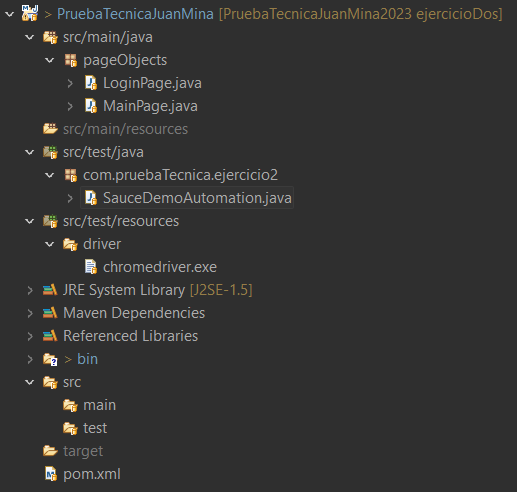

# PruebaTecnicaJuanMina2023

## Dentro de este repositorio Git se encuentran los 5 puntos de la prueba técnica. 

En la carpeta Punto1 Resultados se encuentran las imágenes de los resultados de la ejecución del código realizado

1. Crear un algoritmo para: obtener los números enteros del string.
2. Retornar la suma de estos.
String myString=
"asfsdalgkjerio435j342234234nh234o32rnowei23io4h324oi32423o4w.,345.,34534534ew f342rasfsdalgkjerio435j342234234nh234o32rnowei23io4h324oi32423o4w.,345.,3453453 4ewf342rasfsdalgkjerio435j342234234nh234o32rnowei23io4h324oi32423o4w.,345.,345 34534ewf342rasfsdalgkjerio435j342234234nh234o32rnowei23io4h324oi32423o4w.,345.
,34534534ewf342rasfsdalgkjerio435j342234234nh234o32rnowei23io4h324oi32423o4w., 345.,34534534ewf342r"

Nota:
• Se debe subir el código a un repositorio se espera que este repositorio tenga un push inicial y al menos un pull request.

En la carpeta Punto2Resultados se encuentran las imágenes de los resultados de la ejecución del código realizado

• Puede usar librerías externas como plus para la automatización. Ejemplo: Apache POI, TestNG, JUnit, etc.
• Puede utilizar el patrón de diseño de su preferencia, se recomienda P.O.M

Nombre Proyecto: AutomatizacionExcelCredit
Automatice los casos de prueba que se necesiten para realizar adiciones al carrito en la página: https://www.saucedemo.com/
Nota:
• Se debe subir el código a un repositorio se espera que este repositorio tenga un push inicial y al menos un pull request (diferente al anterior).
• Se esperan mínimo 5 escenarios.

En la carpeta Punto3SQL se encuentran los SQL con los querys realizados, se adjunta imagen con la ejecución de los querys

Ejercicio 1: Consultar el supermercado que tenga más cantidad de productos con el tipo “CARNICOS” que han vendido hasta la fecha 31 de diciembre del 2013 retornando el nombre del supermercado, la cantidad, la descripción del tipo de supermercado y la fecha de venta.

Ejercicio 2: Seleccionar los clientes que compran en el SUPERMERCADO “Exito” cuya compra supera los $150.000 mil pesos e imprimir todos los datos del cliente más el nombre del supermercado y el valor de venta, y ordenarlos descendentemente.

Los puntos 4 y 5 son documentos Word que están adjuntos en en Punto4PruebaTécnica y Punto5Teórico respectivamente.

Adjunto también imágenes de cómo se encuentra el repositorio actualmente con los dos pull requests solicitados y los commits realizados en cada rama donde se realizaron los ejercicios uno y dos respectivamente.

### Punto 1 Pull Request y Commits

### Punto 2 Pull Request y Commits

